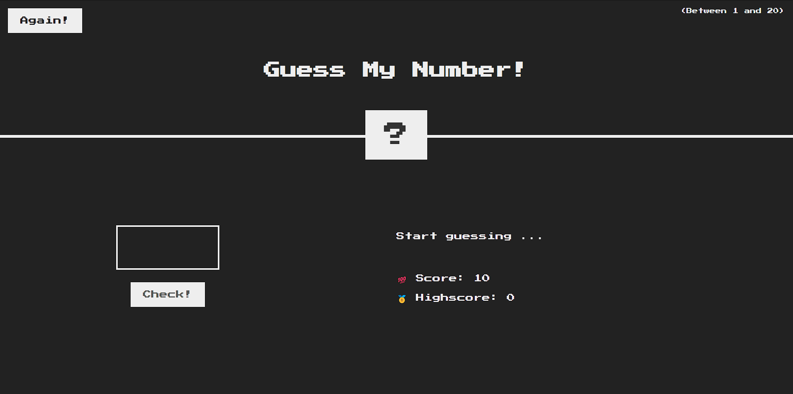

# Guess my number

GUESS NUMBER AND WIN THE PRIZE!

## Introduction

A simple game project made by JavaScript, HTML and CSS just to demonstrate my basic knowledge of programming and how to using events and methods to manipulate DOM by JS

## Key Features

- **user friendly app**
- **has sound effects, visual texts and animations to guide user and give him/her better experience**
- **can be playeble by any devices**

## Screenshot

## Link to deployed page

https://arminmeybodi.github.io/Guess-my-number/
